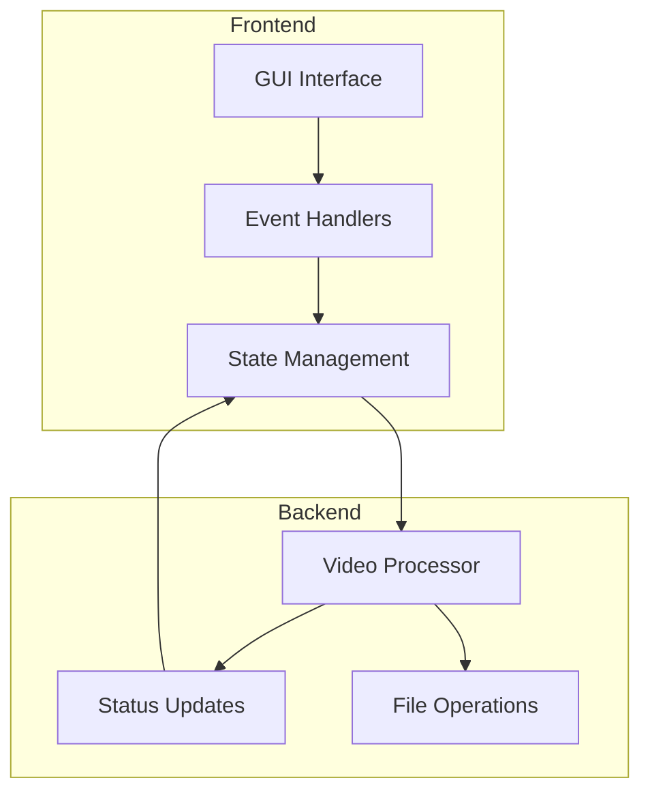
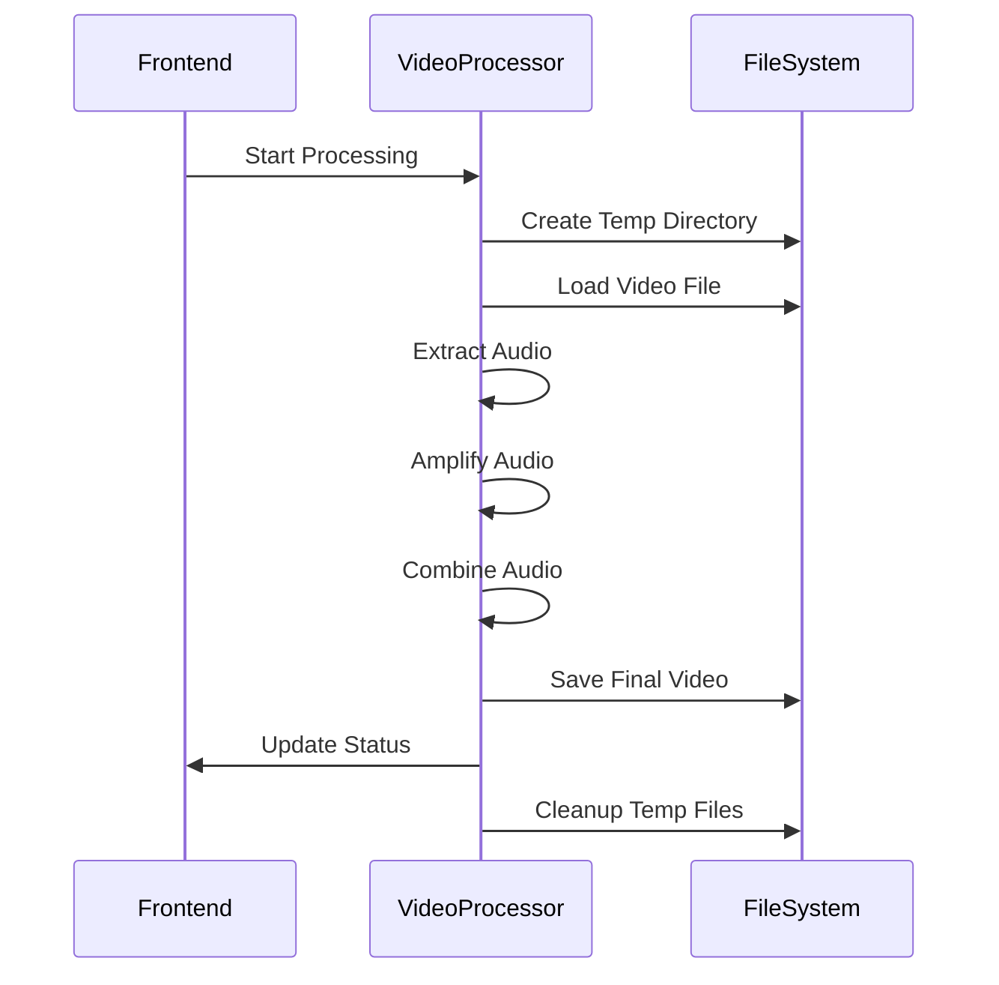
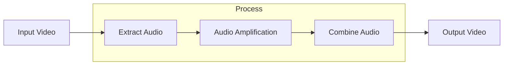
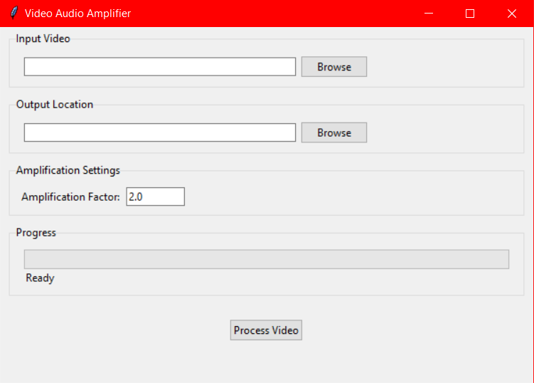

# Video Audio Amplifier 🎵


A powerful desktop application for amplifying audio in video files with a user-friendly interface. Built with Python using a clean architecture pattern.

## 🎯 Features

- 📊 Real-time progress tracking
- 🎚️ Adjustable amplification factor
- 🎥 Support for multiple video formats
- 📁 Intuitive file selection interface
- 🧰 Clean architecture with separated backend/frontend
- 🔄 Non-blocking UI during processing

## 📋 Requirements

- Python 3.8+
- MoviePy
- PyDub
- Tkinter (usually comes with Python)

## 🚀 Installation

1. Clone the repository
```bash
git clone https://github.com/archibald-carrion/Video-audio-amplifier.git
cd Video-audio-amplifier
```

2. Install required packages
```bash
pip install moviepy pydub
```

## 🎮 Usage

Run the application:
```bash
python main.py
```

### Step-by-step guide:

1. Click "Browse" to select an input video file
2. Choose output location (auto-suggested with '_amplified' suffix)
3. Adjust amplification factor (default: 2.0)
4. Click "Process Video" to start
5. Monitor progress through the progress bar

## 🏗️ Architecture

### Overview

The application follows a clean architecture pattern with clear separation between the backend processing logic and frontend UI components.




### Component Breakdown

#### Backend (`VideoProcessor`)

The backend is responsible for all video processing operations and maintains its own state through the `ProcessingStatus` class.



Key components:
- `ProcessingStatus`: Data class for tracking processing state
- Status callback system for progress updates
- Clean error handling and reporting
- Temporary file management

#### Frontend (`VideoAmplifierGUI`)

The frontend handles all user interaction and display logic, communicating with the backend through a clean interface.

Components:
- File selection dialogs
- Progress tracking display
- Status updates
- Input validation
- Threading for non-blocking operations

## 🔧 Technical Details

### Data Flow



## Screenshots


## 🔜 Future Improvements

- [ ] Add batch processing capability
- [ ] Implement preview functionality of the video before and after processing
- [ ] After processing a video clean the loading bar
- [ ] Make a more modern and user-friendly interface
- [ ] Add support for more file formats, including audio-only files
- [ ] Add screenshots of the application in the README
- [ ] Add dependencies.txt file to the repository and update the README with installation instructions